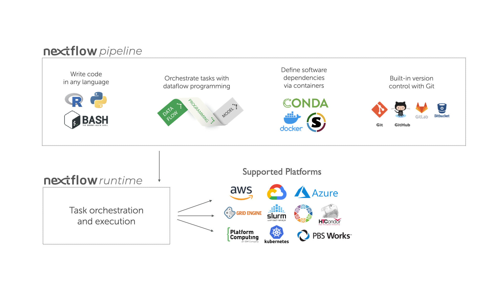

## Workflows
Analysing data involves a sequence of tasks, including gathering, cleaning, and processing data. This sequence of tasks is called a workflow or a pipeline. These workflows typically require executing multiple software packages, sometimes running on different computing environments, such as a desktop or a compute cluster. Traditionally these workflows have been joined together in scripts using general purpose programming languages such as Bash or Python.

<center>
    
    <br>
    <em> Broad Institute, GATK Best Practices Workflow. </em>
</center>

<br>

However, as workflows become larger and more complex, the management of the programming logic and software becomes difficult.

## Workflow management systems

*Workflow Management Systems* (WfMS) such as [Snakemake](https://snakemake.readthedocs.io/en/stable/),
[Galaxy](https://usegalaxy.org/), and [Nextflow](nextflow.io) have been developed specifically to manage computational data-analysis workflows in fields such as bioinformatics, imaging, physics, and chemistry. These systems contain multiple features that simplify the development, monitoring, execution and sharing of pipelines, such as:
- Run time management
- Software management
- Portability \& Interoperability
- Reproducibility
- Re-entrancy

<br>
<center>

<br>
<em>
An example of differences between running a specific analysis workflow using a traditional pipeline or a WfMS-based pipeline. Source: Wratten, L., Wilm, A. & Göke, J. Reproducible, scalable, and shareable analysis pipelines with
bioinformatics workflow managers. Nat Methods 18, 1161–1168 (2021). https://doi.org/10.1038/s41592-021-01254-9 
</em>
</center>
<br>

## Nextflow core features

<br>
<center>
{alt="Infographic illustrating the components and supported platforms of a nextflow pipeline. The top section 'nextflow pipeline' is divided into three: writing code in any language, orchestrating tasks with dataflow programming, and defining software dependencies via containers and version control. Below is the nextflow runtime section for task orchestration and execution, followed by supported platforms including AWS, Google Cloud, Azure, Grid Engine, Slurm, HTCondor, Kubernetes, and PBS Works."}
    

<br>
<em> Overview of Nextflow core features. </em>
</center>
<br>

- **Fast prototyping**: A simple syntax for writing pipelines that enables you
  to reuse existing scripts and tools for fast prototyping.

- **Reproducibility**: Nextflow supports several container technologies, such
  as [Docker](https://www.docker.com/) and [Singularity](https://sylabs.io/singularity),
  as well as the package manager [Conda](https://docs.conda.io). This, along
  with the integration of the [GitHub](https://www.github.com) code sharing
  platform, allows you to write self-contained pipelines, manage versions and
  to reproduce any previous result when re-run, including on different
  computing platforms.

- **Portability \& interoperability**: Nextflow's syntax separates the
  functional logic (the steps of the workflow) from the execution settings (how
  the workflow is executed). This allows the pipeline to be run on multiple
  platforms, e.g. local compute vs. a university compute cluster or a cloud
  service like [AWS](https://aws.amazon.com/), without changing the steps of
  the workflow.

- **Simple parallelism**:  Nextflow is based on the dataflow programming model
  which greatly simplifies the splitting of tasks that can be run at the same
  time (parallelisation).

- **Continuous checkpoints \& re-entrancy**: All the intermediate results
  produced during the pipeline execution are automatically tracked. This allows
  you to resume its execution from the last successfully executed step, no
  matter what the reason was for it stopping.

## Processes, channels, and workflows

Nextflow workflows have three main parts: *processes*, *channels*, and
*workflows*.

- *Processes* describe a task to be run. A process script can be written in any
  scripting language that can be executed by the Linux platform (Bash, Perl,
  Ruby, Python, R, etc.). Processes spawn a task for each complete input set.
  Each task is executed independently and cannot interact with other tasks. The
  only way data can be passed between process tasks is via asynchronous queues,
  called *channels*.

- Processes define inputs and outputs for a task. *Channels* are then used to
  manipulate the flow of data from one process to the next.

- The interaction between processes, and ultimately the pipeline execution flow
  itself, is then explicitly defined in a *workflow* section.

In the following example we have a channel containing three elements, e.g.,
three data files. We have a process that takes the channel as input. Since the
channel has three elements, three independent instances (tasks) of that process
are run in parallel. Each task generates an output, which is passed to another
channel and used as input for the next process.

<p align="center">      <br>   <em> Nextflow process flow diagram. </em>
</p>

## Workflow execution

While a `process` defines what command or script has to be executed, the
`executor` determines how that script is actually run in the target system.

If not otherwise specified, processes are executed on the local computer. The
local executor is very useful for pipeline development, testing, and
small-scale workflows, but for large-scale computational pipelines, a High
Performance Cluster (HPC) or Cloud platform is often required.

<p align="center">      <br>   <em>Nextflow Executors</em>
</p>

Nextflow provides a separation between the pipeline's functional logic and the
underlying execution platform. This makes it possible to write a pipeline once,
and then run it on your computer, compute cluster, or the cloud, without
modifying the workflow, by defining the target execution platform in
a configuration file.

Nextflow provides out-of-the-box support for major batch schedulers and cloud
platforms such as Sun Grid Engine, SLURM job scheduler, AWS Batch service and
Kubernetes; a full list can be found [here](https://www.nextflow.io/docs/latest/executor.html).

## Running Nextflow Workflows

We are now going to move from concepts to practice. In this section, we will run a series of Nextflow scripts, starting from a very simple example and gradually moving to a more realistic genomics workflow.

Your first script

We begin with a minimal Nextflow script to verify that our environment is working and to introduce the basic structure of a workflow.

Create a file named hello.nf in your working directory and copy the following code:
```groovy
#!/usr/bin/env nextflow

nextflow.enable.dsl=2

process SAY_HELLO {

    output:
    stdout

    script:
    """
    echo 'Hello Nextflow!'
    """
}

workflow {
    SAY_HELLO()
}
```

Understanding the script

This script contains the following components:

A process block (SAY_HELLO) which defines a task to be executed.
An output definition, which captures the standard output (stdout) of the process.
A script block, which contains the command to be executed (in this case, a simple echo).
A workflow block, which defines how processes are executed.
Running the script

To execute the workflow, run:
```bash
nextflow run hello.nf
```

You should see output similar to:
```
Hello Nextflow!
```
{: .output}

> ##  What just happened?
>
> > ## Even though this is a simple command, Nextflow has:
> >
> > created a working directory for the task
> > executed the process in isolation
> > tracked the execution in a log file
> {: .solution}
{: .challenge}

Inspecting execution artifacts

List the contents of your directory:
```bash
$ ls
```
You should see:

.nextflow.log — a log file tracking execution
work/ — a directory containing task-level execution data

Inspect the work/ directory:
```bash
ls work
```
Each subdirectory corresponds to a single execution of a process task.

Inspecting real data

We will now run a slightly more realistic workflow that operates on sequencing data described in a samplesheet.

Create a file named inspect_reads.nf and copy the following code:
```groovy
#!/usr/bin/env nextflow

nextflow.enable.dsl=2

params.samplesheet = "data/samplesheet/samplesheet.local.csv"

process INSPECT_READS {

    tag "${sample_id}"

    input:
    tuple val(sample_id), path(read1), path(read2)

    output:
    stdout

    script:
    """
    echo "Sample ID: ${sample_id}"
    echo "Read 1: ${read1}"
    echo "Read 2: ${read2}"
    zcat ${read1} | head -n 1
    echo "-----"
    """
}

workflow {

    Channel
        .fromPath(params.samplesheet)
        .splitCsv(header: true)
        .map { row ->
            tuple(
                row.sample_id,
                file(row.read1_path, checkIfExists: true),
                file(row.read2_path, checkIfExists: true)
            )
        }
        .set { reads_ch }

    INSPECT_READS(reads_ch)
}
```

Understanding the script

This script introduces several important concepts:

A parameter (params.samplesheet) specifying the location of input metadata
A channel, created from the samplesheet
A mapping step, which converts each row into a tuple of:
sample_id
read1 file
read2 file
A process (INSPECT_READS) that is executed once per input tuple

Running the script
```bash
nextflow run inspect_reads.nf
```

> ##  What do you observe?
>
> > The process runs multiple times
> > Each execution corresponds to one row in the samplesheet
> > You will see repeated sample_id values
> {: .solution}
{: .challenge}

Inspect the samplesheet:
```bash
cat data/samplesheet/samplesheet.local.csv
```

Each row represents a single paired-end sequencing run (lane).
Since each biological sample was sequenced across multiple lanes, the same sample_id appears multiple times.

At this stage, each lane is processed independently.

Inspecting the work directory
```bash
ls work/
```

Navigate into one of the directories:

```bash
cd work/<hash>/
ls
```

You will find:

input files staged for execution
intermediate files generated by the process

Each of these directories represents an independent task execution.

> ## Key concept
>
> Nextflow automatically creates one task per input item, allowing workflows to scale naturally with the size of the data.
> 
{: .callout}
Key concept

Running a complete workflow

We now run a complete workflow that performs multiple steps typical of a genomics analysis.

Running the pipeline
```bash
nextflow run main.nf -profile docker
```

This workflow performs the following steps:

merges sequencing lanes for each sample
runs quality control (FastQC)
aligns reads to a reference genome
sorts and indexes alignment files
generates summary statistics
produces a MultiQC report

Inspecting outputs

List the results directory:
```bash
ls results/
```

You should see subdirectories such as:
```
merged_fastq/
fastqc/
bam/
qc/
multiqc/
```

Each directory corresponds to the output of a different stage in the workflow.

Understanding what happened

Although we have not yet examined the workflow code in detail, Nextflow has:
- executed multiple processes
- passed data between them
- tracked all intermediate outputs
- organized final outputs in a structured directory

Inspecting execution logs
```bash
less .nextflow.log
```

This file contains:
- execution details
- commands run
- task-level information

Inspecting task-level execution
```bash
ls work/
```

Each directory corresponds to a single execution of a process task, just as in previous examples, but now across multiple workflow steps.

## Re-running the workflow

Run the pipeline again with:
```bash
nextflow run main.nf -resume
```

You will observe that:
- completed tasks are not re-run
- Nextflow resumes from the last successful step

> ## Key concept
>
> Nextflow tracks intermediate results and enables reproducible and efficient re-execution of workflows.
{: .callout}
